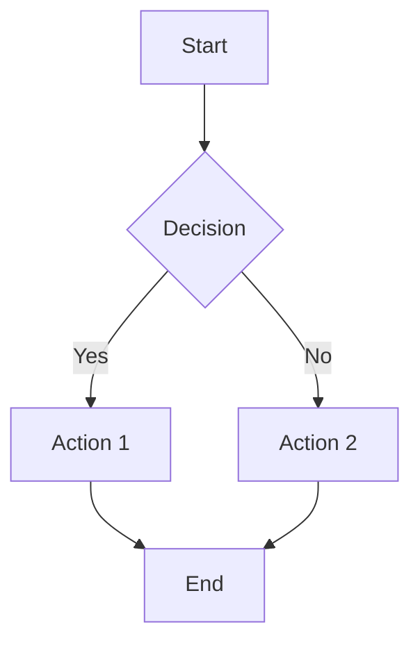
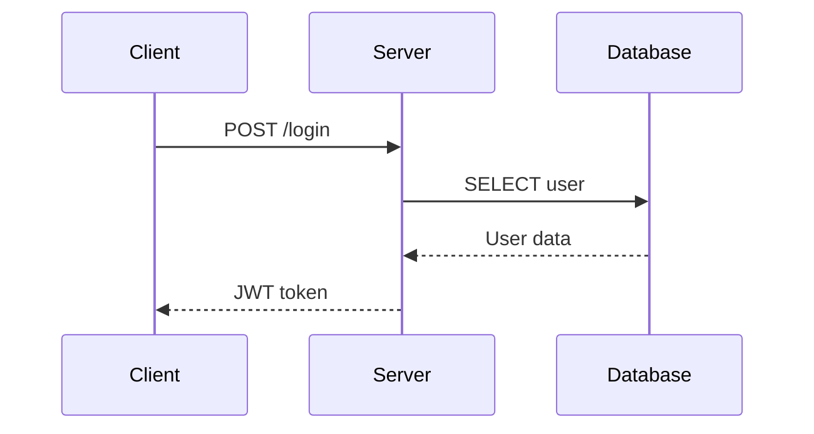
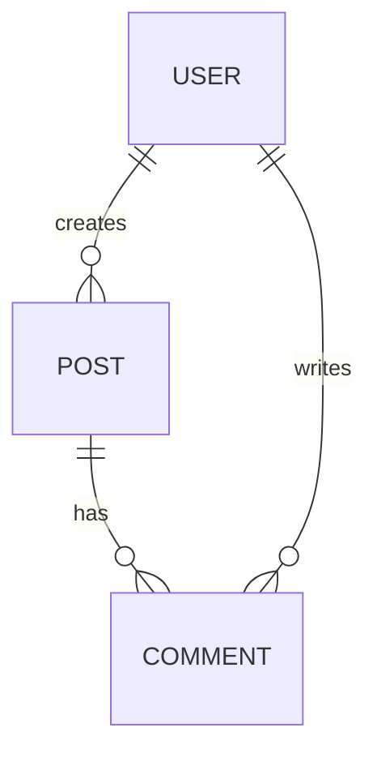

# Visual Preview

Generate visual explanations using ASCII art, Mermaid diagrams, and structured slides.

## Usage

```
/visual-preview --explain <topic>   # Visual explanation (ASCII + Mermaid + prose)
/visual-preview --diagram <topic>   # Focused diagram only
/visual-preview --slides <topic>    # Presentation slides
/visual-preview --ascii <topic>     # Terminal-friendly (no browser needed)
```

## When to Use

**Automatically use when:**
- User asks "explain", "how does X work", "visualize"
- Topic has 3+ interacting components
- Data flow needs clarification
- Architecture decisions being made
- Onboarding to complex codebase

## Output Modes

### --explain: Full Visual Explanation

Combines ASCII overview + Mermaid details + prose explanation.

**Output structure:**
```markdown
# {Topic} Explained

## Overview
[ASCII diagram showing high-level flow]

## Detailed Flow
[Mermaid sequence/flowchart]

## Key Concepts
[Bullet points with explanations]

## Example
[Code snippet or usage example]
```

### --diagram: Focused Diagram

Single Mermaid diagram with minimal prose.

**Diagram types:**
- `flowchart` - Process flows, decision trees
- `sequenceDiagram` - API calls, interactions
- `classDiagram` - Object relationships
- `erDiagram` - Database schema
- `stateDiagram` - State machines
- `gantt` - Timelines, schedules

### --slides: Presentation Format

One concept per slide, progressive disclosure.

**Slide structure:**
```markdown
---
# Slide 1: Title
[Main point]

---
# Slide 2: Problem
[What we're solving]

---
# Slide 3: Solution
[Diagram + explanation]

---
# Slide 4: Implementation
[Key code or steps]

---
# Slide 5: Summary
[Key takeaways]
```

### --ascii: Terminal-Friendly

Pure ASCII art, no external rendering needed.

```
┌─────────────┐     ┌─────────────┐     ┌─────────────┐
│   Client    │────►│   Server    │────►│  Database   │
└─────────────┘     └─────────────┘     └─────────────┘
       │                   │                   │
       │   HTTP Request    │    SQL Query      │
       │──────────────────►│──────────────────►│
       │                   │                   │
       │   JSON Response   │    Result Set     │
       │◄──────────────────│◄──────────────────│
```

## ASCII Art Components

### Boxes
```
┌─────────┐  ╔═════════╗  ┏━━━━━━━━━┓
│ Simple  │  ║ Double  ║  ┃  Bold   ┃
└─────────┘  ╚═════════╝  ┗━━━━━━━━━┛
```

### Arrows
```
────►  ◄────  ─────  ═════
  │      │      │      ║
  ▼      ▲      │      ║
```

### Flow Example
```
     ┌──────────────────────────────────────┐
     │           Authentication Flow        │
     └──────────────────────────────────────┘
                       │
                       ▼
              ┌────────────────┐
              │  Login Request │
              └───────┬────────┘
                      │
          ┌───────────┴───────────┐
          ▼                       ▼
   ┌─────────────┐        ┌─────────────┐
   │ Valid Creds │        │Invalid Creds│
   └──────┬──────┘        └──────┬──────┘
          │                      │
          ▼                      ▼
   ┌─────────────┐        ┌─────────────┐
   │ Issue Token │        │ Return 401  │
   └──────┬──────┘        └─────────────┘
          │
          ▼
   ┌─────────────┐
   │  Dashboard  │
   └─────────────┘
```

## Mermaid Syntax Reference

### Flowchart


### Sequence Diagram


### Entity Relationship


## Output Location

Save generated visuals to:
```
{project}/plans/visuals/{topic-slug}.md
```

If no active plan context:
```
plans/visuals/{topic-slug}.md
```

## Examples

### Example 1: Explain WebSocket

```
/visual-preview --explain WebSocket connection lifecycle
```

**Output:**
```markdown
# WebSocket Connection Lifecycle

## Overview
┌──────────┐  HTTP Upgrade   ┌──────────┐
│  Client  │────────────────►│  Server  │
└────┬─────┘                 └────┬─────┘
     │                            │
     │◄───── 101 Switching ──────►│
     │                            │
     │◄═══════ WebSocket ════════►│
     │      (bidirectional)       │

## Detailed Flow
sequenceDiagram
    Client->>Server: HTTP GET /ws (Upgrade: websocket)
    Server-->>Client: 101 Switching Protocols
    loop Message Exchange
        Client->>Server: Send message
        Server-->>Client: Send message
    end
    Client->>Server: Close frame
    Server-->>Client: Close acknowledgment

## Key Concepts
- **Handshake**: Starts as HTTP, upgrades to WS
- **Full-duplex**: Both sides can send anytime
- **Persistent**: Single connection, no polling
- **Frames**: Messages split into frames
```

### Example 2: ASCII Architecture

```
/visual-preview --ascii microservices architecture
```

**Output:**
```
                    ┌─────────────────┐
                    │   Load Balancer │
                    └────────┬────────┘
                             │
         ┌───────────────────┼───────────────────┐
         │                   │                   │
         ▼                   ▼                   ▼
   ┌───────────┐       ┌───────────┐       ┌───────────┐
   │  Auth API │       │ Users API │       │Orders API │
   └─────┬─────┘       └─────┬─────┘       └─────┬─────┘
         │                   │                   │
         └───────────────────┼───────────────────┘
                             │
                    ┌────────┴────────┐
                    │   Message Queue │
                    └────────┬────────┘
                             │
              ┌──────────────┼──────────────┐
              ▼              ▼              ▼
        ┌──────────┐   ┌──────────┐   ┌──────────┐
        │  Auth DB │   │ Users DB │   │Orders DB │
        └──────────┘   └──────────┘   └──────────┘
```

## Integration

- Use with `sequential-thinking` for complex explanations
- Use in `project-manager` workflow for architecture docs
- Use in `code-review` for visualizing changes
